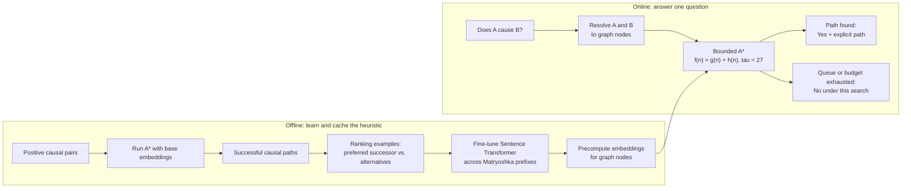
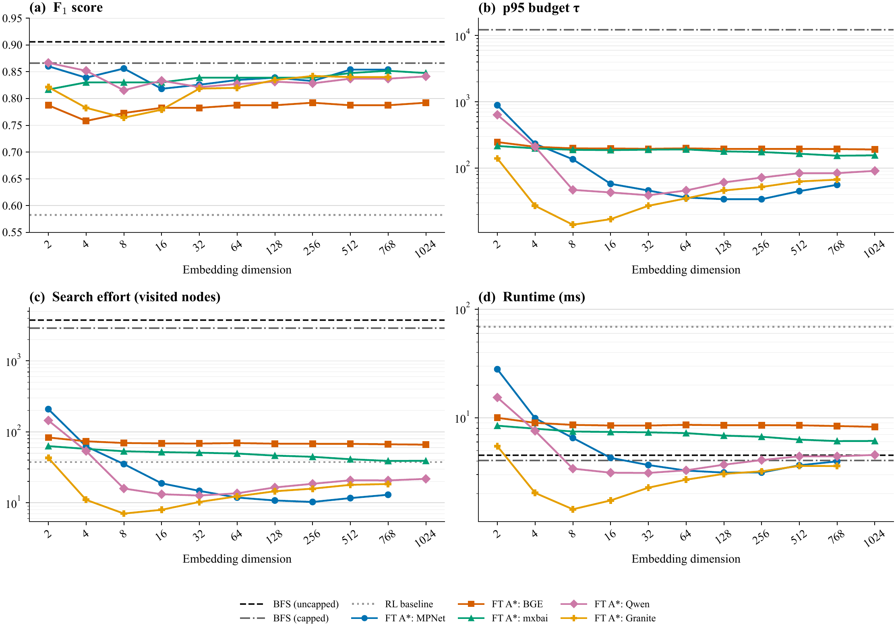
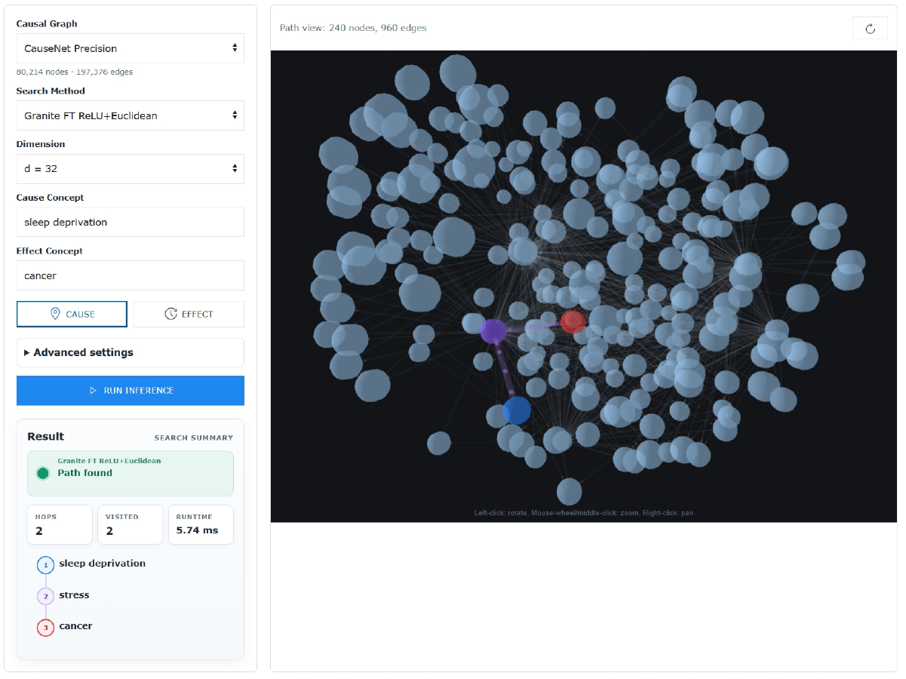

# Efficient Causal Question Answering with Learned A* Heuristics

A Python/PyTorch system that answers binary questions such as **“Does A cause B?”** by searching for directed paths in causal knowledge graphs. It fine-tunes Sentence Transformer embeddings for graph-search efficiency, then uses them to guide bounded A* over graphs with up to 12.2 million nodes.

**Core stack:** Python · PyTorch · PyTorch Lightning · Sentence Transformers · NetworkX · Optuna · FastAPI · 3d-force-graph

> **Key idea:** instead of learning a traversal policy, learn the search heuristic. The selected configuration is **Granite Embedding R2 · 32-dimensional Matryoshka prefix · ReLU · Euclidean distance · A* budget τ = 27**.

**Headline result:** on the 12.2-million-node CauseNet Full graph, A* averaged **8.5 visited nodes and 10.8 ms per query**, versus uncapped BFS at 77,445.8 nodes and 345.4 ms, while scoring 80.4 vs. 89.9 F1.

## Why this project exists

Large causal knowledge graphs make causal relationships explicit and can return a path that explains why two concepts are connected. The engineering challenge is search: breadth-first search (BFS) is complete, but can expand thousands or hundreds of thousands of nodes for one query. An RL traversal policy can reduce exploration, but requires repeated neural inference during beam search.

This project uses a middle ground:

- keep the search procedure explicit and interpretable with A*;
- guide it with sentence-embedding distances learned specifically for causal graph traversal;
- precompute graph-node embeddings so query-time work is mostly indexed lookup, distance calculation, and priority-queue operations;
- bound the search to control worst-case work on large and dense graphs.

## How it works



For a node `n`, A* prioritizes the smallest estimated total cost:

```text
f(n) = g(n) + h(n)

g(n): accumulated embedding distance from the source to n
h(n): Euclidean embedding distance from n to the target
```

The edge cost between two adjacent concepts is also their Euclidean embedding distance. Fine-tuning turns successful search paths into pairwise ranking examples: the next node on a discovered path should receive a lower estimated traversal cost than the current node’s alternative successors.

The same objective is applied to nested Matryoshka prefixes. This makes the first 32 dimensions useful on their own, reducing stored vector width and distance-computation work by **24×** relative to Granite’s native 768-dimensional representation.

### Final selected configuration

| Component | Selection |
|---|---|
| Embedding backbone | `ibm-granite/granite-embedding-english-r2` |
| Representation | 32-dimensional Matryoshka prefix |
| Training activation | ReLU |
| Search distance | Euclidean |
| A* visit budget | `τ = 27` |
| Selection rule | Lowest validation runtime among fine-tuned candidates with F1 ≥ 80.0, then visited nodes and F1 |

## Example: “Does sleep deprivation cause cancer?”

The interactive demo can return the directed path:

```text
sleep deprivation → stress → cancer
```

Under the graph-based task definition, finding that path produces a **Yes** answer together with the path as an explanation. It means the connection is encoded in the evaluated knowledge graph; it is not, by itself, proof of real-world causality.

## Results

The final system was evaluated on graph-covered MS MARCO and SemEval binary causal questions across CauseNet Precision, CauseNet Full, and CEG Filtered. The table below shows the representative **MS MARCO test** comparison. Each cell reports **F1 / average visited nodes / milliseconds per query**.

| Graph | A* (ours) | BFS, uncapped | RL baseline | BFS node reduction |
|---|---:|---:|---:|---:|
| CauseNet Precision | **85.5 / 7.7 / 1.7** | 90.6 / 2,731.3 / 3.7 | 70.3 / 32.0 / 67.2 | ≈356× |
| CauseNet Full | **80.4 / 8.5 / 10.8** | 89.9 / 77,445.8 / 345.4 | 69.9 / 44.6 / 654.6 | ≈9,077× |
| CEG Filtered | **92.0 / 2.3 / 2.3** | 90.9 / 4,130.8 / 384.1 | 84.6 / 24.3 / 5,138.5 | ≈1,786× |

Main takeaways:

- **Large-graph efficiency:** on CauseNet Full, A* visited about 9,077× fewer nodes and was 32.1× faster than uncapped BFS. The trade-off was 80.4 vs. 89.9 F1.
- **Better bounded trade-off:** against capped BFS on CauseNet Full, A* achieved higher F1 (80.4 vs. 74.4), visited about 577× fewer nodes (8.5 vs. 4,922.7), and was 14.7× faster (10.8 vs. 158.2 ms).
- **Strong dense-graph result:** on CEG Filtered / MS MARCO, the observed A* F1 was higher than both baselines while it visited about 1,786× fewer nodes than uncapped BFS. The A*–BFS F1 difference was not statistically significant after correction.
- **Consistent RL comparison:** across all six final graph/dataset settings, A* observed higher F1 and lower runtime than the evaluated LSTM-based RL baseline.

Runtime was measured on one Webis SLURM node with eight CPU cores, 128 GB RAM, and a Hopper GPU; graph loading and embedding-cache loading were excluded. Visited nodes are therefore the more hardware-independent efficiency measure. CEG Filtered covers 48 MS MARCO test examples, so its F1 result should be interpreted with that sample size in mind. RL visited-node accounting follows the baseline implementation and differs from BFS/A*, so direct node-count comparisons with RL are less meaningful.

### Why 32 dimensions?

The validation sweep below compares F1, the p95 search budget, visited nodes, and runtime across Matryoshka dimensions. The selected Granite curve reaches a low-cost operating point at 32 dimensions while remaining above the F1 selection threshold.



*Validation on MS MARCO with CauseNet Precision. Cost-related axes use logarithmic scales. Figure adapted from the thesis.*

The source values for the final comparison are in [`thesis/tables/test_res.tex`](thesis/tables/test_res.tex), with machine-readable outputs produced under `code/data/evaluation/` after the research artifacts are restored.

## Key technical contributions

- **Learned A* heuristic:** adapts semantic embedding models to causal graph reachability instead of training a separate traversal policy.
- **Search-aligned supervision:** automatically builds `(current, target, preferred successor, alternative successor)` training examples from successful causal paths.
- **Matryoshka search representations:** trains multiple nested prefixes so one checkpoint supports configurable embedding widths.
- **Indexed inference path:** combines precomputed NumPy/memmap embeddings, indexed graph adjacency, batched distance calculations, and bounded priority-queue search.
- **Comparative evaluation:** evaluates fine-tuned and pretrained embedding models against uncapped/capped BFS, Dijkstra, and an LSTM RL baseline on multiple graphs and datasets.
- **End-to-end tooling:** includes preprocessing, Optuna hyperparameter search, PyTorch Lightning training, embedding precomputation, evaluation, significance tests, plots, and a FastAPI demo.

## Interactive 3D demo

The repository includes a FastAPI application with a 3d-force-graph frontend. It lets users choose a causal graph and search configuration, run a query, inspect hops/visited nodes/runtime, and explore the discovered path in an interactive 3D neighborhood.



The default launcher uses the selected Granite model at `d=32` on CauseNet Precision:

```powershell
cd code
python app.py
```

Open `http://127.0.0.1:9000`. The demo requires the CauseNet Precision graph, selected model checkpoint, and matching embedding cache under `code/data/`. In [`code/app.py`](code/app.py), `load_all = False` keeps startup to the selected A* configuration; setting it to `True` preloads all supported graphs, A* variants, BFS, and RL and requires substantially more memory.

The frontend loads 3d-force-graph and supporting UI libraries from CDNs, so the browser also needs internet access when the demo page starts.

## Repository structure

```text
.
├── code/
│   ├── core/                 # Graph/model registries, embedding caches, indexed inference
│   ├── traverse_strategies/  # A*, BFS, Dijkstra, and RL traversal
│   ├── finetune/             # Training data, Optuna search, final training, ablations
│   ├── evaluation/           # Evaluation, model selection, statistics, and visualization
│   ├── preprocessing/        # Dataset normalization and CEG filtering
│   ├── web_demo/             # FastAPI API and 3d-force-graph frontend
│   ├── tests/                # Cache, graph, registry, and reporting tests
│   ├── app.py                # Local demo launcher
│   └── requirements.txt
└── thesis/
    ├── chapters/             # Thesis chapters
    ├── tables/               # Exact experimental tables
    └── figures/              # Thesis figures
```

## Installation

From the repository root:

```powershell
python -m venv .venv
# Activate .venv for your shell, then:
python -m pip install --upgrade pip
python -m pip install -r code/requirements.txt
python -m nltk.downloader punkt punkt_tab stopwords
cd code
```

A CUDA-capable GPU is recommended for training, embedding precomputation, and the complete evaluation. CPU execution is supported by the relevant `--embedding-device cpu` options, but full-graph runs are resource intensive.

## Data, graphs, and research artifacts

> **TODO: Add updated Zenodo archive / DOI**

The previous Zenodo version is intentionally not presented as the current release. Model checkpoints, normalized datasets, embedding caches, and evaluation outputs are too large for Git and are expected under:

```text
code/data/datasets/filtered/
code/data/embeddings/
code/data/evaluation/
code/data/models/lightning/
code/data/models/rl/
```

The original graph files are downloaded separately:

| Graph | Official source | Repository path |
|---|---|---|
| CauseNet Precision | [CauseNet downloads](https://causenet.org/) | `code/data/graphs/causenet-precision.jsonl` |
| CauseNet Full | [CauseNet downloads](https://causenet.org/) | `code/data/graphs/causenet-full.jsonl` |
| Cause Effect Graph (CEG) | [CausalBank / CEG](https://github.com/eecrazy/CausalBank) | `code/data/graphs/Lexical_Cause_Effect_Graph.txt` |

CauseNet downloads are distributed as `.jsonl.bz2`; decompress them and keep the filenames shown above. To create the filtered CEG used in the experiments, run from `code/`:

```powershell
python -m preprocessing.filter_ceg_graph
```

This writes `data/graphs/Lexical_Cause_Effect_Graph.filtered.txt`. The binary causal dataset splits originate from the [RL baseline repository](https://github.com/ds-jrg/causal-qa-rl); normalized files are expected at the paths above.

## Reproduce the experiments

All commands in this section run from `code/` after the required graphs and research artifacts are in place.

Preview the orchestrated workflow without starting an experiment:

```powershell
python -m evaluation.run_all_evaluations --run-suffix v3 --dry-run
```

Run the main validation/model-selection stage and final Granite `d=32` test comparison across the default graphs and datasets:

```powershell
python -m evaluation.run_all_evaluations --run-suffix v3 --skip-dijkstra --skip-ablation
```

The full workflow is expensive and reruns existing rows by default. Add `--no-force` to reuse completed results. Omit `--skip-dijkstra` and `--skip-ablation` to include those experiment phases.

Generate plots from stored evaluation results:

```powershell
python -m evaluation.evaluation_viz --all --run-suffix v3
```

<details>
<summary><strong>Optional: fine-tune Granite and precompute embeddings</strong></summary>

Hyperparameter search and final training:

```powershell
python -m finetune.hparam_search --model ibm-granite/granite-embedding-english-r2 --run-suffix v3 --trials 50 --epochs 10 --patience 5
python -m finetune.finetune_best --model ibm-granite/granite-embedding-english-r2 --run-suffix v3 --epochs 50 --patience 10
```

Precompute the selected 32-dimensional cache for the shared CauseNet Precision / CEG node universe:

```powershell
python -m core.pre_embed --model data/models/lightning/granite-embedding-english-r2_relu_euclid_nonorm_matryoshka_v3_finetuned --dim 32 --run-suffix v3
```

CauseNet Full has a separate node universe and cache:

```powershell
python -m core.pre_embed --model data/models/lightning/granite-embedding-english-r2_relu_euclid_nonorm_matryoshka_v3_finetuned --dim 32 --run-suffix v3 --graph causenet_full
```

</details>

## Technologies

| Area | Technologies |
|---|---|
| ML and optimization | PyTorch, PyTorch Lightning, Sentence Transformers, Hugging Face Datasets, Optuna |
| Graph search | NetworkX, A*, BFS, Dijkstra, LSTM-based RL traversal |
| Efficient inference | NumPy memmaps, precomputed embeddings, indexed adjacency, Matryoshka representations |
| Evaluation | scikit-learn, pandas, Matplotlib, paired stratified bootstrap tests |
| Demo | FastAPI, Uvicorn, JavaScript, 3d-force-graph |

## Scope and limitations

This is a system for **causal path discovery**, not general causal inference. Automatically extracted knowledge graphs can contain missing, noisy, ambiguous, or overly general relations, and causal relations are not always safely transitive. A found path is evidence that the graph encodes a connection. A negative answer can also mean that the graph lacks the relation or that bounded A* exhausted `τ=27` before reaching it.

The system does not estimate effect sizes, validate causal claims from raw evidence, or perform interventional or counterfactual reasoning.

## Thesis and citation

The complete LaTeX source for the 2026 bachelor thesis, **“Learning Heuristics for Efficient Causal Question Answering Using A* Search,”** is included in [`thesis/`](thesis/).

```bibtex
@misc{kiafard2026causalastar,
  author = {Ashkan Kiafard},
  title  = {Learning Heuristics for Efficient Causal Question Answering Using {A*} Search},
  note   = {Bachelor's thesis, University of Kassel},
  year   = {2026}
}
```

## License

No repository license has been added yet. Until a license is provided, the code should be treated as all rights reserved.
