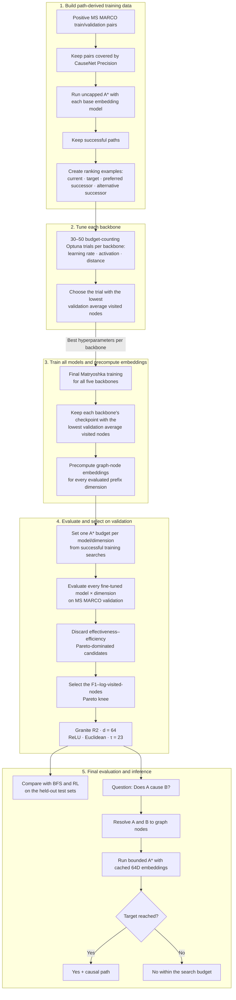

# Efficient Causal Question Answering with Learned A* Heuristics

A Python/PyTorch project for binary causal question answering. Given a question such as **“Does A cause B?”**, it searches for a directed path from `A` to `B` in a causal knowledge graph. Fine-tuned Sentence Transformer embeddings guide bounded A* search on graphs as large as CauseNet Full, which contains 12.2 million nodes.

**Core stack:** Python · PyTorch · PyTorch Lightning · Sentence Transformers · NetworkX · Optuna · FastAPI · 3d-force-graph

> Instead of learning a traversal policy, this project learns the heuristic used by A*.

On the 12.2-million-node CauseNet Full graph, the selected A* configuration averages **7.5 visited nodes and 11.3 ms per MS MARCO query**. Uncapped BFS averages 30,099.3 visited nodes and 59.5 ms, with F1 scores of 82.9 and 89.9 respectively.

## Problem

A graph-based answer can include the path that connects a cause to an effect. The difficult part is finding that path without exploring a large part of the graph. Uncapped breadth-first search (BFS) is exhaustive, but a single query can visit thousands or even tens of thousands of nodes. The evaluated RL baseline explores less of the graph, but repeatedly runs a neural policy during beam search.

This project keeps traversal explicit with A* and learns an embedding space that steers the search toward the target. Graph-node embeddings are computed ahead of time, so a query mainly requires indexed lookups, distance calculations, and priority-queue operations. A visit budget limits the worst-case work on large or dense graphs.

## How it works

Training and evaluation are split into five stages:



1. **Build the training data.** For each base model, positive MS MARCO pairs covered by CauseNet Precision are searched with uncapped A*. A successful path produces `(current node, target, preferred successor, alternative successor)` examples. Cosine and Euclidean searches are generated separately because they can produce different paths.

2. **Tune each embedding model.** Optuna first runs at least 30 budget-counting terminal trials per backbone over the learning rate, activation (`ReLU` or `GELU`), and distance metric (`cosine` or `Euclidean`). Only `COMPLETE` and `PRUNED` trials count. Thereafter, trials launch one at a time until five consecutive counting trials fail to improve the best completed visited-node objective, with a hard maximum of 50; a new completed best resets the counter, while failed or interrupted trials consume neither budget nor counter. This step chooses training hyperparameters for each backbone; it does not choose the final backbone or embedding dimension.

3. **Train and cache every candidate.** All five backbones are trained with their own best hyperparameters for up to 50 epochs. For each backbone, the checkpoint with the lowest validation average visited-node count is kept. The Matryoshka objective sums the task/ranking loss over all configured prefixes without averaging or self-normalization and applies the existing embedding regularizer once globally. The resulting graph-node embeddings are stored in indexed, memory-mapped NumPy arrays for each evaluated dimension.

4. **Select one configuration on validation data.** Each fine-tuned model and Matryoshka dimension receives its own A* budget, calculated as the 95th percentile of visited nodes on successful MS MARCO training searches. The candidates are then evaluated on MS MARCO validation with CauseNet Precision. Pareto-dominated configurations are discarded using F1 and average visited nodes; the normalized F1–log-visited-nodes knee on the remaining frontier identifies the point of diminishing returns without an arbitrary effectiveness cutoff. Granite Embedding R2 at 64 dimensions is selected. Its tuned setup uses ReLU and Euclidean distance, and its search budget is `τ = 23`.

5. **Evaluate the selected system.** The Granite configuration is frozen before the final comparison with BFS and RL on the MS MARCO and SemEval test sets across three graphs. Test data are not used for model selection. Binary evaluation uses reachability-only A*/BFS: it returns as soon as the target is discovered and avoids parent maps and path reconstruction. The interactive frontend uses path mode, preserving the explicit causal path for interpretation.

For a candidate node `n`, A* prioritizes the smallest estimated total cost:

```text
f(n) = g(n) + h(n)

g(n): accumulated embedding distance from the source to n
h(n): Euclidean embedding distance from n to the target
```

In the selected configuration, adjacent concepts are connected by their Euclidean embedding distance, and the Euclidean distance from `n` to the target provides the heuristic. Fine-tuning reshapes the embedding space so that useful successors tend to receive better A* priorities than competing neighbors.

The same objective is applied to nested Matryoshka prefixes. This makes the first 64 dimensions useful on their own, reducing stored vector width and distance-computation work by **12×** relative to Granite’s native 768-dimensional representation.

### Final selected configuration

| Component | Selection |
|---|---|
| Embedding backbone | `ibm-granite/granite-embedding-english-r2` |
| Representation | 64-dimensional Matryoshka prefix |
| Training activation | ReLU |
| Search distance | Euclidean |
| A* visit budget | `τ = 23` |
| Selection data | MS MARCO validation with CauseNet Precision |
| Validation result | 83.5 F1 · 9.1 visited nodes · 1.7 ms/query |
| Selection rule | F1–log-visited-nodes Pareto knee after removing dominated candidates |

## Example: “Does sleep deprivation cause cancer?”

The interactive demo can return the directed path:

```text
sleep deprivation → stress → cancer
```

The answer is **Yes** because the graph contains a directed path from the source to the target. The path explains the graph lookup; it is not independent proof that the causal claim is true in the real world.

## Results

The final system was evaluated on graph-covered MS MARCO and SemEval questions across CauseNet Precision, CauseNet Full, and CEG Filtered. The table reports the **MS MARCO test** results.

| Graph | Method | F1 | Avg. visited nodes | Time/query |
|---|---|---:|---:|---:|
| CauseNet Precision | Selected A* | 86.7 | **6.5** | 1.3 ms |
|  | BFS, uncapped | **90.6** | 1,157.3 | 1.4 ms |
|  | BFS, capped | 90.2 | 134.9 | **0.5 ms** |
|  | RL baseline | 70.3 | 32.0 | 67.7 ms |
| CauseNet Full | Selected A* | 82.9 | **7.5** | 11.3 ms |
|  | BFS, uncapped | **89.9** | 30,099.3 | 59.5 ms |
|  | BFS, capped | 87.2 | 135.1 | **9.4 ms** |
|  | RL baseline | 69.9 | 44.6 | 658.1 ms |
| CEG Filtered | Selected A* | **92.0** | **2.3** | **4.8 ms** |
|  | BFS, uncapped | 90.9 | 492.1 | 44.3 ms |
|  | BFS, capped | **92.0** | 30.2 | 5.8 ms |
|  | RL baseline | 84.6 | 24.3 | 5,129.0 ms |

The clearest efficiency gain appears on CauseNet Full. Relative to uncapped BFS, A* visits about 4,011× fewer nodes and runs 5.3× faster on MS MARCO; on SemEval it visits about 11,308× fewer nodes and runs 16.0× faster. The corresponding F1 differences are -7.1 and +9.5 points. Compared with capped BFS, A* visits 18.0× to 31.7× fewer nodes; its F1 is 4.3 points lower on MS MARCO and 0.6 points lower on SemEval.

On CEG Filtered / MS MARCO, A* ties capped BFS for the highest F1 and visits about 213× fewer nodes than uncapped BFS. That F1 difference is not statistically significant after correction. Across all six graph/dataset test settings, A* has higher F1 and lower runtime than the evaluated LSTM-based RL baseline.

Runtime was measured on Webis SLURM jobs with eight CPU cores, 64 GB RAM, and one Hopper GPU; graph loading and embedding-cache loading were excluded. Visited nodes are therefore the more hardware-independent efficiency measure. CEG Filtered covers 48 MS MARCO test examples, so its F1 result should be interpreted with that sample size in mind. RL visited-node accounting follows the baseline implementation and differs from BFS/A*, so direct node-count comparisons with RL are less meaningful.

### Why 64 dimensions?

The validation sweep compares F1, the p95 search budget, visited nodes, and runtime across Matryoshka dimensions. Granite at 64 dimensions reached 83.5 F1 with 9.1 visited nodes and 1.7 ms per query. Smaller prefixes can reduce search effort further, while larger prefixes can gain effectiveness, but the normalized Pareto-knee criterion selects 64 dimensions as the empirical point of diminishing returns between these objectives.


*Validation on MS MARCO with CauseNet Precision. Cost-related axes use logarithmic scales. Figure adapted from the thesis.*

Exact final-test values are in [`thesis/tables/test_res.tex`](thesis/tables/test_res.tex). Evaluation runs write their machine-readable results to `code/data/evaluation/`.

## Technical highlights

- Successful A* paths are converted into ranking examples for fine-tuning the embedding heuristic.
- A Matryoshka training objective makes several prefix dimensions usable from the same checkpoint.
- A*/BFS share path and reachability-only modes, avoiding path-specific allocation during binary evaluation.
- Precomputed NumPy memmaps and indexed adjacency structures avoid encoder inference during graph traversal.
- The evaluation covers fine-tuned and pretrained embeddings, capped and uncapped BFS, Dijkstra, and an LSTM-based RL baseline.
- The repository includes preprocessing, Optuna tuning, PyTorch Lightning training, model selection, statistical tests, plots, and an interactive FastAPI demo.

## Interactive demonstration

The FastAPI demo uses 3d-force-graph to display the discovered path and its surrounding graph neighborhood. It also reports the path length, visited nodes, and runtime for the selected search configuration.

Hosted demo (planned): [pathfinding.demo.causenet.org](https://pathfinding.demo.causenet.org/)


### Run locally

The default local launcher uses the selected Granite model at `d=64` on CauseNet Precision:

```powershell
cd code
python app.py
```

Open `http://127.0.0.1:9000`. The demo requires the CauseNet Precision graph, selected model checkpoint, and matching embedding cache under `code/data/`. In [`code/app.py`](code/app.py), `load_all = False` keeps startup to the selected A* configuration; setting it to `True` preloads all supported graphs, A* variants, BFS, and RL and requires substantially more memory.

The frontend loads 3d-force-graph and supporting UI libraries from CDNs, so the browser also needs internet access when the demo page starts.

## Repository structure

```text
.
├── code/
│   ├── core/                 # Graph/model registries, embedding caches, indexed inference
│   ├── traverse_strategies/  # A*, BFS, Dijkstra, and RL traversal
│   ├── finetune/             # Training data, Optuna search, final training, ablations
│   ├── evaluation/           # Evaluation, model selection, statistics, and visualization
│   ├── preprocessing/        # Dataset normalization and CEG filtering
│   ├── web_demo/             # FastAPI API and 3d-force-graph frontend
│   ├── tests/                # Cache, graph, registry, and reporting tests
│   ├── app.py                # Local demo launcher
│   └── requirements.txt
└── thesis/
    ├── chapters/             # Thesis chapters
    ├── tables/               # Exact experimental tables
    └── figures/              # Thesis figures
```

## Installation

From the repository root:

```powershell
python -m venv .venv
# Activate .venv for your shell, then:
python -m pip install --upgrade pip
python -m pip install -r code/requirements.txt
python -m nltk.downloader punkt punkt_tab stopwords
cd code
```

A CUDA-capable GPU is recommended for training, embedding precomputation, and the complete evaluation. CPU execution is supported by the relevant `--embedding-device cpu` options, but full-graph runs are resource intensive.

## Data, graphs, and research artifacts

> **TODO: Add updated Zenodo archive / DOI**

Model checkpoints, normalized datasets, embedding caches, and evaluation outputs are too large for Git. Once downloaded or generated, they are expected under:

```text
code/data/datasets/filtered/
code/data/embeddings/
code/data/evaluation/
code/data/models/lightning/
code/data/models/rl/
```

The original graph files are downloaded separately:

| Graph | Official source | Repository path |
|---|---|---|
| CauseNet Precision | [CauseNet downloads](https://causenet.org/) | `code/data/graphs/causenet-precision.jsonl` |
| CauseNet Full | [CauseNet downloads](https://causenet.org/) | `code/data/graphs/causenet-full.jsonl` |
| Cause Effect Graph (CEG) | [CausalBank / CEG](https://github.com/eecrazy/CausalBank) | `code/data/graphs/Lexical_Cause_Effect_Graph.txt` |

CauseNet downloads are distributed as `.jsonl.bz2`; decompress them and keep the filenames shown above. To create the filtered CEG used in the experiments, run from `code/`:

```powershell
python -m preprocessing.filter_ceg_graph
```

This writes `data/graphs/Lexical_Cause_Effect_Graph.filtered.txt`. The binary causal dataset splits originate from the [RL baseline repository](https://github.com/ds-jrg/causal-qa-rl); normalized files are expected at the paths above.

## Reproduce the experiments

All commands in this section run from `code/` after the required graphs and research artifacts are in place.

Print the evaluation commands without running them:

```powershell
python -m evaluation.run_all_evaluations --run-suffix v4 --select-best-from-validation --dry-run
```

Evaluate all fine-tuned candidates on validation, apply the Pareto-knee selection rule, and use the winner for the test runs:

```powershell
python -m evaluation.run_all_evaluations --run-suffix v4 --select-best-from-validation --skip-dijkstra --skip-ablation
```

The full workflow is expensive and reruns existing rows by default. Add `--no-force` to reuse completed results. Omit `--skip-dijkstra` and `--skip-ablation` to include those experiment phases.

Generate plots from stored evaluation results:

```powershell
python -m evaluation.evaluation_viz --all --run-suffix v4
```

<details>
<summary><strong>Optional: train candidate models from scratch</strong></summary>

The commands below show hyperparameter search and final training for Granite. To reproduce cross-model selection from scratch, run the same stages for every embedding backbone defined in the project configuration, then precompute their evaluated Matryoshka dimensions.

```powershell
python -m finetune.hparam_search --model ibm-granite/granite-embedding-english-r2 --run-suffix v4 --trials 50 --epochs 10 --patience 5
python -m finetune.finetune_best --model ibm-granite/granite-embedding-english-r2 --run-suffix v4 --epochs 50 --patience 10
```

Precompute the selected 64-dimensional cache for the shared CauseNet Precision / CEG node universe:

```powershell
python -m core.pre_embed --model data/models/lightning/granite-embedding-english-r2_relu_euclid_nonorm_matryoshka_v4_finetuned --dim 64 --run-suffix v4
```

CauseNet Full has a separate node universe and cache:

```powershell
python -m core.pre_embed --model data/models/lightning/granite-embedding-english-r2_relu_euclid_nonorm_matryoshka_v4_finetuned --dim 64 --run-suffix v4 --graph causenet_full
```

</details>

## Technologies

| Area | Technologies |
|---|---|
| ML and optimization | PyTorch, PyTorch Lightning, Sentence Transformers, Hugging Face Datasets, Optuna |
| Graph search | NetworkX, A*, BFS, Dijkstra, LSTM-based RL traversal |
| Efficient inference | NumPy memmaps, precomputed embeddings, indexed adjacency, Matryoshka representations |
| Evaluation | scikit-learn, pandas, Matplotlib, paired stratified bootstrap tests |
| Demo | FastAPI, Uvicorn, JavaScript, 3d-force-graph |

## Scope and limitations

This is a system for **causal path discovery**, not general causal inference. Automatically extracted knowledge graphs can contain missing, noisy, ambiguous, or overly general relations, and causal edges are not necessarily transitive. A found path means that the graph encodes a connection. A negative answer can also mean that the graph lacks the relation or that bounded A* exhausted `τ=23` before reaching it.

The system does not estimate effect sizes, validate causal claims from raw evidence, or perform interventional or counterfactual reasoning.

## Thesis and citations

The LaTeX source for the bachelor thesis **“Learning Heuristics for Efficient Causal Question Answering Using A\* Search”** is included in [`thesis/`](thesis/).

The datasets, causal graphs, embedding models, search methods, and baseline systems used in this project are cited in the thesis. Their BibTeX entries are collected in [`thesis/literature.bib`](thesis/literature.bib).
